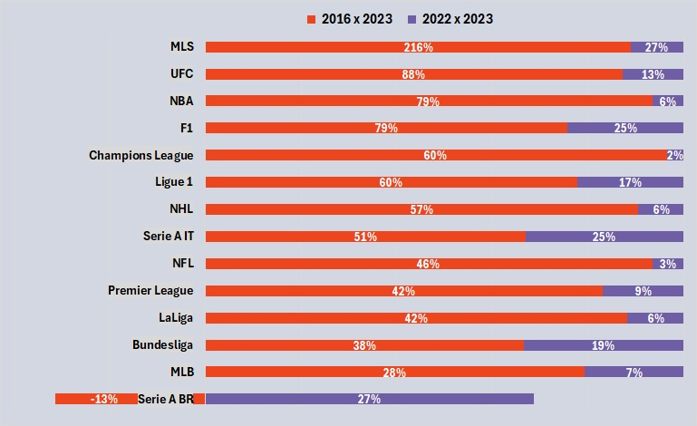

# 🥊 UFC Data Lab – Comprehensive UFC Fights Dataset & Analysis  
UFC is the **largest MMA promotion** in the world, it is in the top 5-10 sports promotions in the US, and **growing**! It **outgrew** such leagues as the NBA, F1, Champions League, NHL, NFL, MLB, and others in terms of relative pct growth over the last 7 years. 

<p align="center">
  
</p>

---
This repository is a complete **UFC fights dataset** project containing every single **UFC fight**, **fighter stats**, and official **fight scorecards**.  

Data was scraped, **OCR-parsed** from scorecard images (using [PaddleOCR](https://github.com/PaddlePaddle/PaddleOCR)), cleaned, and preprocessed for analysis. Finally, the data was explored through **EDA-driven storytelling** and summarized in a **presentation of key findings**.  

<p align="center">
  
</p>


## 📊 Project Outcomes  
By the end of this project, the following were achieved:  
✔️ UFC fight stats scraped  
✔️ UFC scorecards scraped  
✔️ Scorecards OCR-parsed  
✔️ Dataset cleaned & preprocessed  
✔️ Final dataset organized for analysis  
✔️ EDA questions posed & answered  
✔️ Results presented in a clear report  


## 🔑 Features  
- 📥 **Scraping UFC Stats & Scorecards** – automated collection of official data  
- 🔍 **OCR Processing** – extracting structured data from official scorecard images  
- 🧹 **Data Cleaning & Preprocessing** – ready-to-use datasets for research & analysis  
- 📂 **Organized Dataset Storage** – structured for smooth EDA workflows  
- 📈 **Exploratory Data Analysis (EDA)** – insights into UFC fights, fighters, and outcomes  
- 🎤 **Presentation of Findings** – data-driven stories and visualizations  


## 📡 Data Sources  
- [UFC Official Fight Statistics](http://ufcstats.com/)  
- [UFC Official Scorecards](https://www.ufc.com/scorecards/)  


## ⚙️ Installation  
Clone the repo and set up the environment:  

```bash
# 1. Clone repository
git clone https://github.com/komaksym/UFC-DataLab.git

# 2. Verify conda installation
conda --version

# 3. Create virtual environment from config
conda env create -f environment.yml

# 4. Activate the environment
conda activate paddle_env
```

## 📂 Directory Structure  

```bash
UFC-DataLab/
├── data/                     
│   ├── external_data/         # External reference datasets
│   ├── merged_stats_n_scorecards/   # Final merged dataset
│   ├── scorecards/            # Raw + OCR-processed scorecards
│   ├── src/                   # Data-related scripts & notebooks
│   └── stats/                 # UFC fight statistics
│
├── src/                       
│   ├── EDA/                   # Exploratory Data Analysis notebooks
│   ├── scorecard_OCR/         # OCR parsing scripts
│   └── scraping/              # Web scraping spiders
│
└── tests/                     
    ├── OCR_parsing/           # OCR unit tests
    └── scrapers/              # Scraper unit tests
```

## 🤝 Contributing  

Contributions are welcome!  

- Open an **Issue** to report bugs or request features  
- Submit a **Pull Request (PR)** for improvements  


## ⭐ Why This Project Matters  

This project provides one of the **most complete UFC datasets** available — combining official fight stats with **OCR-parsed scorecards**. It opens the door for:  

- Sports analytics & machine learning models  
- UFC win prediction research  
- Fighter performance tracking  
- Data storytelling around MMA  

👉 If you find this project useful, don’t forget to **⭐ star this repository** to support its growth!  
