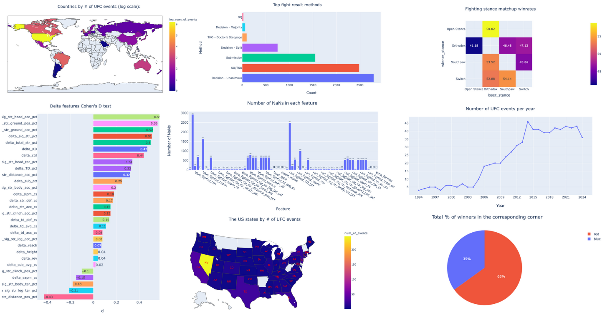

# UFC Data Lab

This repository contains the collection of the UFC fights dataset, consisting of every single UFC fight data, every single UFC fighter's data and all of the UFC fight scorecards. After scraping the data, the scorecard images were OCR parsed with the help of <a href="https://github.com/PaddlePaddle/PaddleOCR">this tool</a> and then the data was further cleaned, and preprocessed. Then, as the time was to start doing EDA on UFC fights dataset, some questions were posed, which were answered in the form of EDA-driven stories by the end of the notebook. In addition, a presentation with findings from the data was created. 



## Results
Here's something I achieved by the end of this mini project:
* UFC fight stats scraped
* UFC scorecards scraped
* UFC Scorecards OCR-parsed
* UFC Dataset cleaned
* Dataset preprocessed
* Questions posed
* Answers given
* Presentation created


## Features
- Scraping UFC stats and scorecards.
- OCR processing of scorecard images.
- Organized dataset storage for analysis.
- Exploratory Data Anslysis.

## Installation
```bash
1. Clone the repository:
git clone https://github.com/komaksym/UFC-DataLab.git
2. Ensure conda is installed:
conda --version
3. Install dependancies and create virtual env:
conda env create -f environment.txt
4. Activate the environment:
conda activate paddle_env
```

## Usage
```bash
1. To scrape  UFC stats:
cd src/scraping/ufc_stats_scraping
scrapy crawl stats_spider

2. To scrape UFC scorecards:
cd src/scraping/ufc_scorecards_scraping
scrapy crawl scorecards_spider

3. To OCR parse the scraped scorecards:
Move your scraped data to the datasets/scorecards/scraped_scorecard_images/new_version_scorecards/
python src/scorecard_OCR/app.py

4. To run tests:
pytest
```

## Directory Structure
```bash 
. 
├── src                                        # Source files
│   ├── EDA                                    # Exploratory Data Analysis
│   ├── datasets                               # Datasets
│   │   ├── merged_stats_n_scorecards          # Merged stats and scorecards dataset
│   │   ├── scorecards                         # Scorecards data
│   │   │   ├── OCR_parsed_scorecards          # OCR parsed scorecards
│   │   │   └── scraped_scorecard_images       # Scraped scorecards
│   │   └── stats                              # Fight stats data
│   ├── scorecard_OCR                          # Scorecard OCR script
│   └── scraping                               # Scraping scripts
│       ├── ufc_scorecards_scraping            # Scorecards scraper
│       │   └── ufc_scorecards_scraping        # Scorecards scraper
│       │       └── spiders                    # Scorecards spider
│       └── ufc_stats_scraping                 # Stats scraper
│           └── ufcstats_scraping              # Stats scraper
│               └── spiders                    # Stats spider
└── tests                                      # Tests
    ├── OCR_parsing                            # OCR tests
    │   └── mock_scorecard                     # Mock data to test OCR on
    └── scrapers                               # Scraper tests
        ├── test_scorecards_scraper            # Scorecard scraper testing
        │   └── mock_pages                     # Mock data to test scorecard scraper on
        │       ├── mock_event_page            # Mock single event page
        │       ├── mock_events_page           # Mock events page
        │       └── mock_scorecard             # Mock scorecard
        └── test_stats_scraper                 # Stats scraper testing
            └── mock_pages                     # Mock data to test stats scraper on
                ├── mock_event_page            # Mock single event page
                ├── mock_events_page           # Mock events page
                └── mock_fight_page            # Mock single fight page
```
